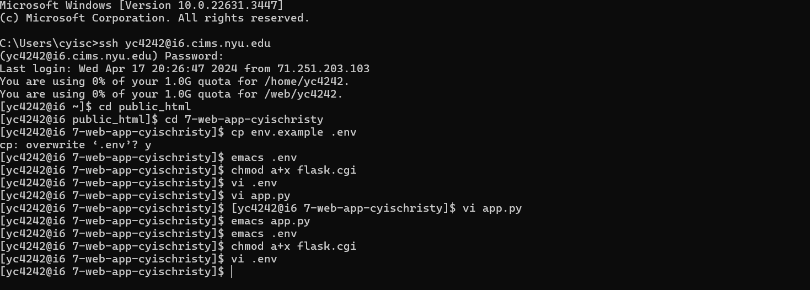
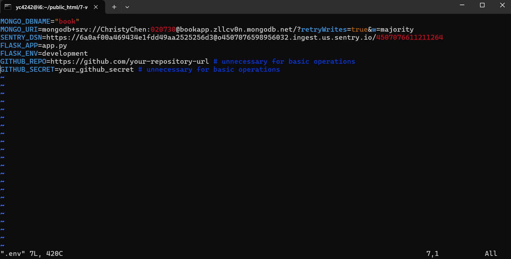
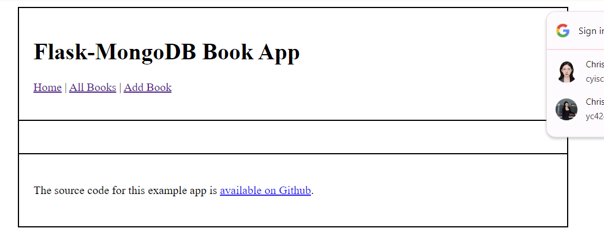
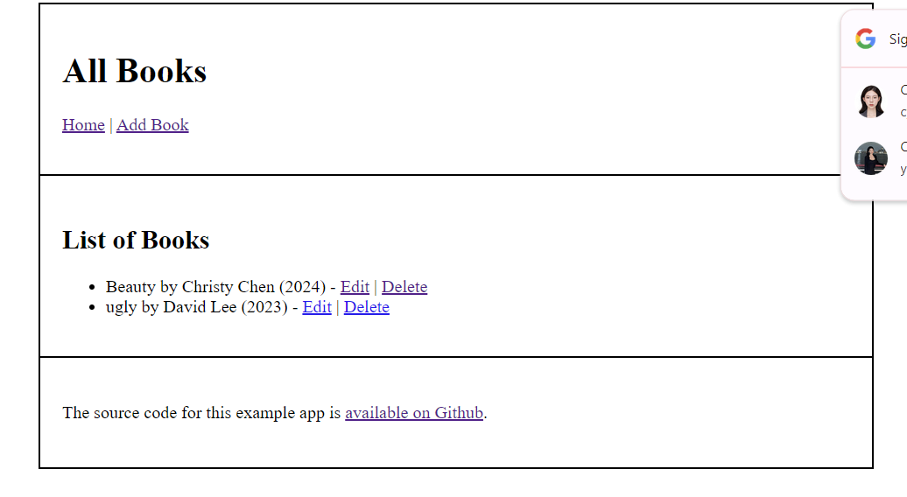
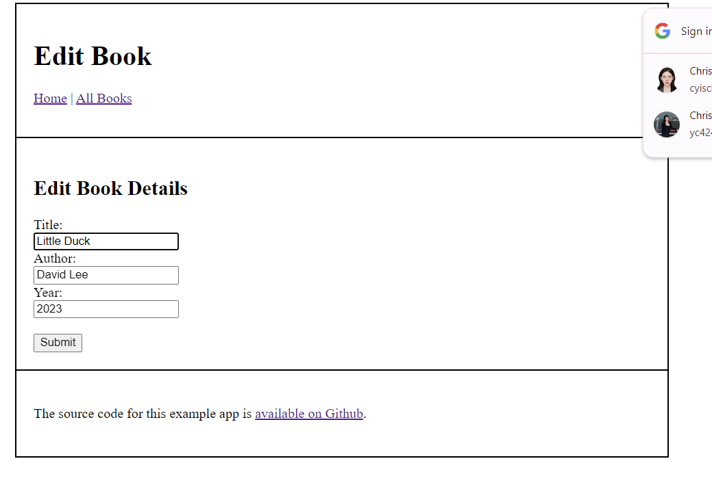
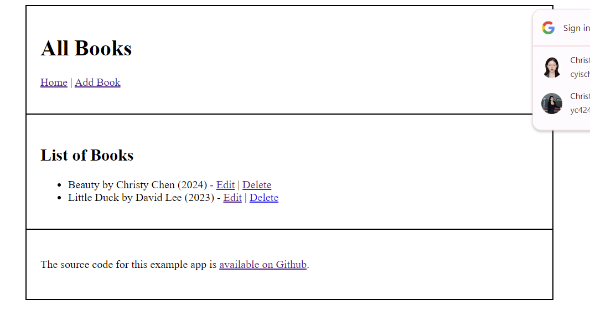
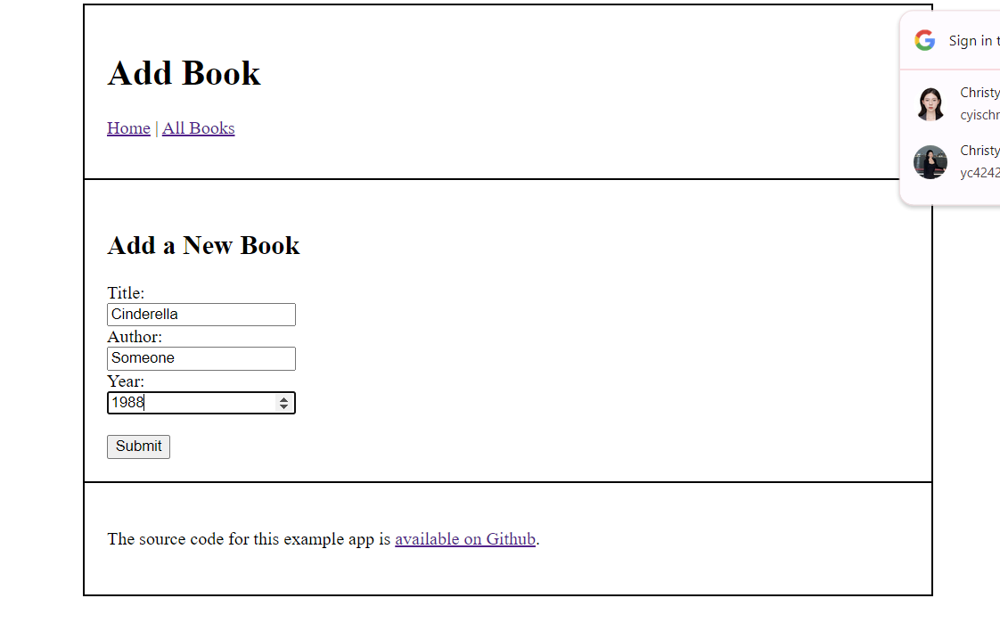
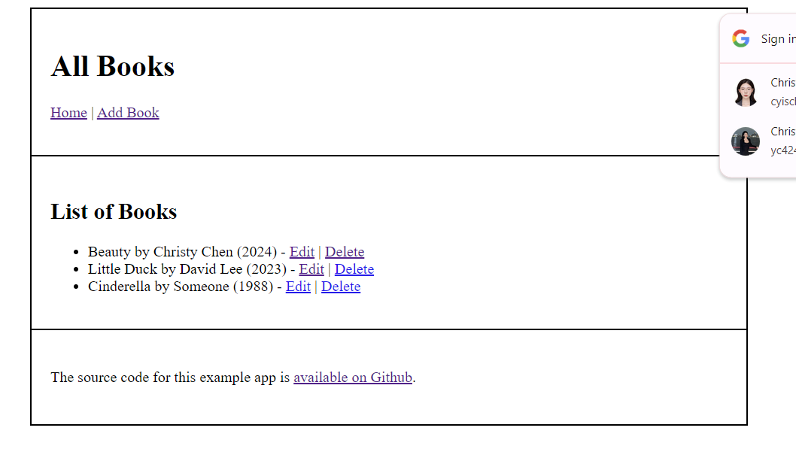

# Flask-MongoDB Web App

## APP name: 

+ Flask-MongoDB Book App

## APP description:

+ This is a small book list app that help user to record all the books they have read and made modification to the list easily.

+ In the **Home Page**, there are three buttoms: **Home**, **All Books**, and **Add Book**.

+ When you click **Home**, you can always get back to the **Home Page**.

+ When you click **Add Book**, you will get into **Add a New Book Page** that requires you to enter information for the book you want to add into the list: **Title**, **Author**, and **Year**. After enter these three information, click **submit** buttom, you will go to the **All Books Page** where shows the full list of the books, includes the one you just enter.

+ When you click **All Books**, you will also get into **All Book Page** that shows the full list of all the books inside the database, for each book, there are two buttoms you can click for next step's operation: **Edit** and **Delete**.

+ When you click **Delete**, you will get into **Delete Book Page** where you can delete the selected book from the book list. In the page, when you click **Delete**, this selected book will be delete from the book list and you will get back to the **All Book Page**, but when you click **Cancel**, you will get back to the **All Book Page** without making any modification to the book list.

+ When you click **Edit**, you will get into **Edit Book Details Page** where you can edit the selected book's details: **Title**, **Author**, and **Year**, and then you can click **Submit** buttom to go back to the **All Book Page**.

## Link:

+ NYU link: https://i6.cims.nyu.edu/~yc4242/7-web-app-cyischristy/flask.cgi

(I followed all the steps inside the instruction for more than twenty times, changed lots of methods and parameters, and went to Sejal's office hour and get helpped for more than two hours, but the website still can't open successfully, it can run on my local machine successfully which means the code should be correct, so I really don't know where is the problem.)

+ Local machine website link: http://127.0.0.1:5000

Evidence for openning the website successfully on my local machine:

